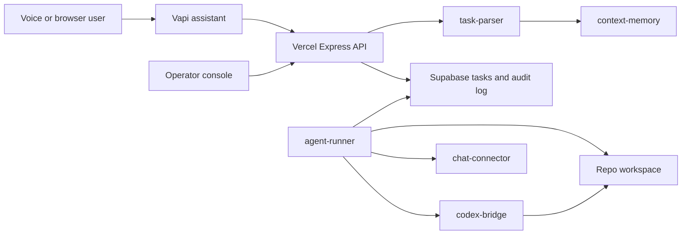

# CallAI Remote Developer Operator

CallAI is a Vapi-powered voice control plane for remote developer operations. The Vercel app hosts the browser voice console, Vapi tool endpoints, webhook receiver, task APIs, and audit views. Long-running repo work runs in a persistent `agent-runner` process that claims queued tasks from Supabase and delegates coding work to Codex CLI or Codex Cloud.

## Architecture



## Local Setup

```bash
npm install
cp .env.example .env
npm run build
npm start
```

For local development:

```bash
npm run dev
npm run frontend:dev
```

Run the persistent task worker in a separate terminal:

```bash
npm run runner
```

## Required Production Services

- Vercel hosts the public Express API and built Vite frontend.
- Supabase stores sessions, transcripts, tasks, execution runs, confirmations, and audit events.
- A persistent runner runs on a trusted machine with Codex CLI authenticated and repo workspace access.
- Vapi routes browser, inbound, and outbound voice calls to the deployed server URLs.

## Vapi Tool Endpoints

Configure each Vapi function tool with `x-api-key: <API_SECRET_KEY>` and these deployed URLs:

- `create_task` -> `POST /tools/create-task`
- `get_task_status` -> `POST /tools/get-task-status`
- `continue_task` -> `POST /tools/continue-task`
- `approve_action` -> `POST /tools/approve-action`
- `cancel_task` -> `POST /tools/cancel-task`
- `send_project_update` -> `POST /tools/send-project-update`
- `start_outbound_call` -> `POST /tools/start-outbound-call`

Configure the webhook URL:

- `POST /vapi/webhook`

For outbound phone calls, set `VAPI_API_KEY`, `VAPI_ASSISTANT_ID`, and `VAPI_PHONE_NUMBER_ID`, then call:

```bash
curl -X POST https://YOUR_SERVER_URL/voice/calls/outbound \
  -H "Content-Type: application/json" \
  -H "x-api-key: $API_SECRET_KEY" \
  -d '{"phone_number":"+15551234567","reason":"Task update"}'
```

## Supabase

Apply the migration in `supabase/migrations/20260420000000_remote_developer_operator.sql`.

Use service-role credentials only on the backend and runner:

```bash
SUPABASE_URL=...
SUPABASE_SERVICE_ROLE_KEY=...
```

The browser never receives Supabase service credentials, OpenAI keys, Vapi private keys, or tool secrets.

## Runner

The runner polls for `tasks.status = 'queued'`, claims one task, creates an execution run, and then:

- inspects repos directly for read-only tasks
- runs configured package tests for test tasks
- creates a `callai/*` branch for write tasks
- delegates code edits to `codex exec --json --sandbox workspace-write --cd <repo>`
- writes progress, stdout, stderr, diffs, and final summaries to the audit log

The runner does not commit, push, merge, deploy, or change secrets without separate approval.

## Safety Model

- `read_only`: inspect repos, read files, query logs, summarize.
- `safe_write`: create branch/worktree, edit files, docs/tests, run tests.
- `full_write`: commit, push branches, open PRs, send external updates.
- `destructive_admin`: delete files, force push, merge to main, production deploy, env/secrets changes, mass rewrites.

`full_write` and `destructive_admin` actions create expiring confirmation requests before execution.
