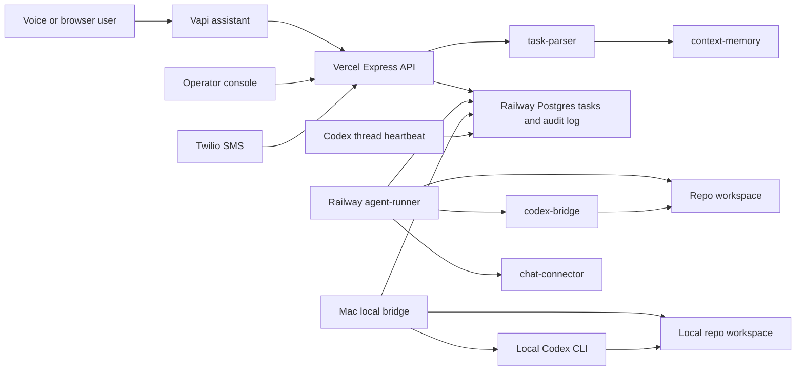

# CallAI Remote Developer Operator

CallAI is a Vapi-powered voice and text control plane for remote developer operations. The Vercel app hosts the browser voice console, Vapi tool endpoints, SMS webhook, task APIs, and audit views. Long-running repo work runs through Railway Postgres and can be claimed by either the Railway `agent-runner` worker or Blake's local Mac bridge using the desktop Codex CLI/auth environment.

## Architecture



## Local Setup

```bash
npm install
cp .env.example .env
npm run build
npm start
```

For local development:

```bash
npm run dev
npm run frontend:dev
```

Run the persistent task worker in a separate terminal:

```bash
npm run build
npm run runner
```

For local runner development without a build, use `npm run runner:dev`.

Run Blake's local desktop bridge manually:

```bash
npm run build
npm run local-bridge
```

Set `RUNNER_ENABLE_FULL_COMPUTER_CONTROL=true` for Telegram/website tasks that
need full Mac GUI or local shell control. Without it, the bridge only claims the
existing normal Chrome desktop tasks.

Set `JARVIS_CODEX_CHAT_ENABLED=true` to let Telegram casual messages use the
local bridge's Codex CLI for delayed soul-style replies. Task execution still
requires the explicit `task ...` trigger.

For local bridge development without a build, use `npm run local-bridge:dev`.

Route queued repo work into this Codex chat:

```bash
CODEX_THREAD_BRIDGE_ENABLED=true
npm run codex-thread:claim
npm run codex-thread:complete -- <task_id> "Summary of what changed"
npm run codex-thread:fail -- <task_id> "Reason it could not be completed"
```

## Required Production Services

- Vercel hosts the public Express API and built Vite frontend.
- Railway Postgres stores sessions, transcripts, tasks, execution runs, confirmations, and audit events.
- A persistent Railway worker runs with Codex CLI authenticated and repo workspace access.
- Vapi routes browser, inbound, and outbound voice calls to the deployed server URLs.

## Vapi Tool Endpoints

Configure each Vapi function tool with `x-api-key: <API_SECRET_KEY>` and these deployed URLs:

- `create_task` -> `POST /tools/create-task`
- `get_task_status` -> `POST /tools/get-task-status`
- `continue_task` -> `POST /tools/continue-task`
- `approve_action` -> `POST /tools/approve-action`
- `cancel_task` -> `POST /tools/cancel-task`
- `send_project_update` -> `POST /tools/send-project-update`
- `start_outbound_call` -> `POST /tools/start-outbound-call`

Configure the webhook URL:

- `POST /vapi/webhook`

For outbound phone calls, set `VAPI_API_KEY`, `VAPI_ASSISTANT_ID`, and `VAPI_PHONE_NUMBER_ID`, then call:

```bash
curl -X POST https://YOUR_SERVER_URL/voice/calls/outbound \
  -H "Content-Type: application/json" \
  -H "x-api-key: $API_SECRET_KEY" \
  -d '{"phone_number":"+15551234567","reason":"Task update"}'
```

## Railway Postgres

Create a Railway project, add a Postgres service, and copy its connection string into `DATABASE_URL`.

Use Railway's public Postgres URL in Vercel production env so the public API can read and write tasks. Use Railway's private/internal Postgres URL for the Railway worker when available.

Run the generic Postgres migration once:

```bash
DATABASE_URL=postgresql://... npm run db:migrate
DATABASE_URL=postgresql://... npm run db:seed
```

The migration lives at `db/migrations/001_remote_developer_operator.sql`.
The seed command inserts the default repo and aliases from `DEFAULT_REPO_*`.

The browser never receives `DATABASE_URL`, Vapi private keys, Codex credentials, or tool secrets.

## Railway Worker

Deploy a second Railway service from this same GitHub repo as a worker. Set the start command to:

```bash
npm run runner
```

The checked-in `railway.toml` sets that worker command. Configure the worker with:

- `DATABASE_URL`
- `DATABASE_SSL=auto`
- `CODEX_EXECUTABLE=codex`
- `CODEX_EXECUTION_MODE=local`
- `DEFAULT_REPO_OWNER`, `DEFAULT_REPO_NAME`, `DEFAULT_REPO_URL`, `DEFAULT_REPO_PATH`, and `DEFAULT_REPO_BRANCH`
- any GitHub/Codex auth variables needed for non-interactive repo work

If the Mac local bridge is the write-capable executor, set the Railway worker to read-only background work:

```bash
RUNNER_ID=railway-runner
RUNNER_TASK_SCOPE=read_only
```

Only one write-capable runner should normally be active. The task queue uses `FOR UPDATE SKIP LOCKED`, so duplicate claiming is protected, but one write-capable runner keeps repo branches, Codex auth, and local workspaces predictable.

## Local Desktop Codex Bridge

The local bridge uses the same Railway Postgres queue as Vercel and Railway, but executes on this Mac with:

- `RUNNER_ID=macbook-local-bridge`
- `CODEX_EXECUTABLE=/Applications/Codex.app/Contents/Resources/codex`
- `DEFAULT_REPO_PATH=/Users/blakeburby/Developer/CallAI-main`
- `CODEX_EXECUTION_MODE=local`

It claims queued tasks, logs runner metadata to the audit timeline, creates `callai/*` branches for write tasks, and invokes:

```bash
codex exec --json --sandbox workspace-write --cd <repo> <prompt>
```

Visible computer control also runs through the Mac local bridge. Requests such
as “open Chrome and go to example.com,” “open Finder and show Downloads,” or
“run ls on Desktop” are parsed as `desktop_control` tasks. Chrome requests keep
using Blake's normal Chrome session and the bounded observe-plan-act browser
loop. Full-Mac and shell requests use the local bridge for app focus/opening,
Finder folders, screenshots, simple keyboard/mouse actions, and safe shell
commands. It records `desktop.*` events for Chrome work and `computer.*` events
for full-Mac/shell work.

For desktop tasks, the bridge writes one latest-only `desktop_snapshots` record
with current state, page/window title, latest action, step count, and a
compressed preview when the screen is not sensitive. Sensitive pages, apps, and
shell sessions are marked redacted and do not store screenshots.

Desktop autonomy defaults:

```bash
DESKTOP_MAX_STEPS=8
DESKTOP_STEP_TIMEOUT_MS=15000
DESKTOP_REQUIRE_CHROME_JS_EVENTS=true
DESKTOP_FAST_AUTONOMY=true
DESKTOP_CAPTURE_SCREENSHOTS=true
RUNNER_ENABLE_FULL_COMPUTER_CONTROL=true
COMPUTER_CONTROL_MAX_STEPS=6
COMPUTER_CONTROL_SHELL_TIMEOUT_MS=20000
COMPUTER_CONTROL_STEP_TIMEOUT_MS=15000
COMPUTER_CONTROL_CONFIRM_RISKY=true
```

Fast autonomy applies only to low-risk browser/Mac work. The bridge blocks
passwords, secrets, 2FA, CAPTCHAs, credential harvesting, banking, and payment
execution. It pauses for approval before external sends, uploads, deletes/trash,
settings changes, shell commands that change state, commits, pushes, deploys,
or other admin-like actions. Railway workers do not claim desktop tasks unless
`RUNNER_ENABLE_DESKTOP_CONTROL=true` is set, and full-Mac/shell tasks require
`RUNNER_ENABLE_FULL_COMPUTER_CONTROL=true`; by default those tasks wait for
`macbook-local-bridge`.

Manual preflight:

```bash
npm run build
npm run local-bridge
```

LaunchAgent setup, after `.env` contains `DATABASE_URL`, Codex executable settings, and the bridge env values. The checked-in LaunchAgent uses `/Users/blakeburby/CallAI-local-bridge` instead of the Desktop checkout so macOS background privacy controls do not block access to the working directory.

```bash
git clone https://github.com/blakeburby/CallAI.git /Users/blakeburby/CallAI-local-bridge
cp /Users/blakeburby/Developer/CallAI-main/.env /Users/blakeburby/CallAI-local-bridge/.env
cd /Users/blakeburby/CallAI-local-bridge
npm install
npm run build
mkdir -p logs ~/Library/LaunchAgents
cp launchd/com.blake.callai.local-bridge.plist ~/Library/LaunchAgents/
launchctl bootstrap gui/$(id -u) ~/Library/LaunchAgents/com.blake.callai.local-bridge.plist
launchctl kickstart -k gui/$(id -u)/com.blake.callai.local-bridge
tail -f logs/local-bridge.out.log logs/local-bridge.err.log
```

Stop/unload:

```bash
launchctl bootout gui/$(id -u) ~/Library/LaunchAgents/com.blake.callai.local-bridge.plist
```

The Mac must be awake, online, and logged in for this LaunchAgent to run.

## Codex Thread Bridge

When `CODEX_THREAD_BRIDGE_ENABLED=true`, CallAI routes repo/code tasks to this
project's Codex thread instead of letting background runners claim them. Desktop
Chrome work and project-chat updates still use the existing runner paths.

The bridge uses Railway Postgres as the inbox. A Codex heartbeat automation runs
from `/Users/blakeburby/Developer/CallAI-main`, claims one waiting task with
`npm run codex-thread:claim`, completes the work in this chat, then records the
result with `npm run codex-thread:complete` or `npm run codex-thread:fail`.

Useful env:

```bash
CODEX_THREAD_BRIDGE_ENABLED=true
CODEX_THREAD_LABEL="CallAI Codex thread"
CODEX_THREAD_STALE_AFTER_MS=900000
```

Background runners skip `execution_target=codex_thread` tasks, so repo work
cannot be silently stolen by Railway while it is waiting for this chat.

## SMS Text Control

Two-way text control uses Twilio. Configure these Vercel production env vars:

- `TWILIO_ACCOUNT_SID`
- `TWILIO_AUTH_TOKEN`
- `TWILIO_FROM_NUMBER`
- `OWNER_PHONE_NUMBER`
- `SMS_WEBHOOK_SECRET`

Set the Twilio Messaging webhook for the SMS-capable Twilio number to:

```text
https://callai-iota.vercel.app/sms/inbound?secret=<SMS_WEBHOOK_SECRET>
```

The SMS endpoint also accepts valid Twilio request signatures using `TWILIO_AUTH_TOKEN`; the query secret is kept as an explicit webhook guard and local smoke-test path.

Inbound SMS is accepted only from `OWNER_PHONE_NUMBER`. Texts are handled as a Jarvis chat first: casual messages get concise replies, work requests create CallAI tasks, status questions inspect the queue, and approval replies such as `approve 123456` or `deny 123456` decide pending confirmations. Completion, failure, blocked, and confirmation-needed notifications are sent back by SMS when Twilio env is configured.

The protected operator console now exposes exact SMS health without exposing secrets:

- webhook auth mode (`query_secret`, `twilio_signature`, or `mixed`)
- verification state (`approved`, `pending`, `rejected`, or `unknown`)
- delivery state (`healthy`, `degraded`, `blocked`, or `unknown`)
- last inbound/outbound timestamps and outbound status
- recent Twilio error code and message
- recent message/failure rows and next-step attention items

Twilio auth tokens, Vapi private keys, Codex credentials, full phone numbers, and `DATABASE_URL` are never exposed in the browser UI.

## Runner

The runner logs a startup preflight for database connectivity, `codex --version`, deterministic chat routing, and workspace settings. Then it polls for `tasks.status = 'queued'`, atomically claims one task with `FOR UPDATE SKIP LOCKED`, creates an execution run, and:

- inspects repos directly for read-only tasks
- runs configured package tests for test tasks
- creates a `callai/*` branch for write tasks
- delegates code edits to `codex exec --json --sandbox workspace-write --cd <repo>`
- writes progress, stdout, stderr, diffs, and final summaries to the audit log

If Codex CLI or auth is missing, coding tasks are marked `blocked` with an audit event. The runner does not commit, push, merge, deploy, or change secrets without separate approval.

## Safety Model

- `read_only`: inspect repos, read files, query logs, summarize.
- `safe_write`: create branch/worktree, edit files, docs/tests, run tests.
- `full_write`: commit, push branches, open PRs, send external updates.
- `destructive_admin`: delete files, force push, merge to main, production deploy, env/secrets changes, mass rewrites.

`full_write` and `destructive_admin` actions create expiring confirmation requests before execution.
